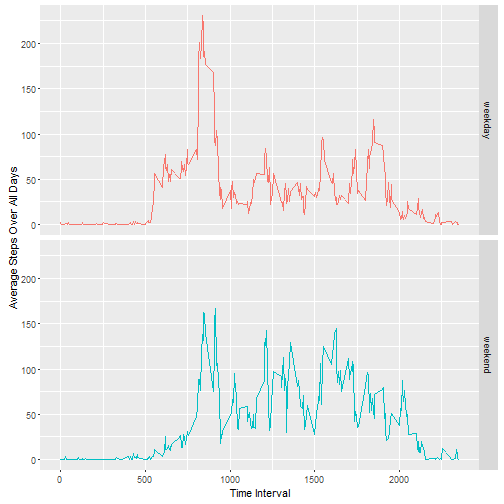

Activity Monitoring Data
========================
Reproducible Research Peer Assessment 1  
---------------------------------------  

Jonathan Owen  
October 18th, 2015  

  
  
  
## Introduction  
**Activity monitoring devices**, *e.g.*, the *Fitbit*, *Nike Fuelband*, 
*Jawbone Up*, and the recent *Apple Watch*, monitor and collect data on the 
activity and basic vital signs of an individual; the intent being to guide the 
health improvement efforts of users. Despite the popularity and successful use
of these devices, much of the data are underutilized. 
  
  
The following work is a simple demonstration of how data from such devices can 
be processed and analyzed to give different views of a person's activities. The
documentation of the work with readable text mixed with code and output is also 
an exploration of the use of literate statistical programming and its 
contribution to reproducible research.

## Data
[Raw data](https://d396qusza40orc.cloudfront.net/repdata%2Fdata%2Factivity.zip)
are from an activity monitoring device. The device recorded the number of 
steps taken by an anonymous individual in 5-minute intervals during a two-month 
period from October to November 2012. For this work the dataset was accessed at 
8:11pm UTC on April 18th, 2015.

  + **dataset**:  [Activity monitoring data](https://d396qusza40orc.cloudfront.net/repdata%2Fdata%2Factivity.zip)
  are available from the course website. (52k, zipped comma separated variable file)
  + **variables**:  17,568 observations of 3 variables.  
    + **steps**:  Number of steps taking in a 5-minute interval. Missing values 
    are coded as `NA`.
    + **date**:  The date on which each measurment was made. 
    Format is YYYY-MM-DD.
    + **interval**:  Identifier for the time at which each measurement was taken.  
    
  
### Reading and processing data  
After downloading the zipped data it is unzipped and read into the `activity`
data frame.

```r
activity <- read.csv(unzip("repdata-data-activity.zip","activity.csv"), 
                     colClasses = c("integer","character","integer"))
```

```
## Warning in unzip("repdata-data-activity.zip", "activity.csv"): error 1 in
## extracting from zip file
```

```
## Error in file(file, "rt"): invalid 'description' argument
```
Here is an example of the what the data look like.

```r
activity[1850:1855,]
```

```
##      steps       date interval
## 1850   247 2012-10-07     1005
## 1851   235 2012-10-07     1010
## 1852   334 2012-10-07     1015
## 1853   389 2012-10-07     1020
## 1854   414 2012-10-07     1025
## 1855    88 2012-10-07     1030
```
The `date` values are converted from a string into a POSIX date using the 
`lubridate` package.

```r
library(lubridate)
activity$date <- ymd(activity$date)
```

## Analysis
### Total number of steps taken each day
The data are summarized by day using the `dplyr` package. `NA` values are
ignored in the sum.

```r
library(dplyr)
```


```r
by_day <-group_by(activity, date) %>% summarize(sum(steps, na.rm = TRUE))
names(by_day) <- c("day", "total_steps")
```

Summary statistics can be calculated.

```r
mean_steps <- prettyNum(mean(by_day$total_steps))
```

```r
median_steps <- prettyNum(median(by_day$total_steps))
```
The mean number of steps per day is **9354.23** and the median is 
**10395**.  
  
  
A histogram of the total number of steps per data can be plotted. The mean and 
median are shown on the histogram as red and blue lines respectively.


```r
bins <- seq(0,26000, by = 2000)
hist(by_day$total_steps, breaks = bins, main = NULL, xlab = "Total Steps per Day")
abline(v = mean_steps, col = "red")
abline(v = median_steps, col = "blue")
```

 
  
### Average number of steps taken by time interval  

Alternatively, the data can be grouped by the time interval, again using the 
`dplyr` package,

```r
by_interval <-group_by(activity, interval) %>% summarize(mean(steps, na.rm = TRUE))
names(by_interval) <- c("time", "average_steps")
```
 
and plotted as a time series.

```r
plot(by_interval$time, by_interval$average_steps, type = "l",
     xlab = "Time Interval", 
     ylab = "Average Steps Over All Days")
```

 

The time interval with the highest average steps can found using the following 
code,

```r
max_time <- by_interval[by_interval$average_steps == max(by_interval$average_steps),1]
```
and is **835**.  
  
### Imputing missing values
The number of missing values, coded as `NA`, can be found using,

```r
total_missing <- sum(is.na(activity$steps))
```
and is **2304**.  

One strategy for imputing these missing values would be to use the average 
value for the time interval.

```r
imputed <- activity
for (i in 1:17568) {
  if (is.na(imputed[i,1]))  {
    imputed[i,1] <- by_interval[by_interval$time == imputed[i,3],2]
  }
}
```
Compare the first 6 rows of `activity`, `imputed`, and `by_interval` to check
imputation.

```r
head(activity)
```

```
##   steps       date interval
## 1    NA 2012-10-01        0
## 2    NA 2012-10-01        5
## 3    NA 2012-10-01       10
## 4    NA 2012-10-01       15
## 5    NA 2012-10-01       20
## 6    NA 2012-10-01       25
```

```r
head(imputed)
```

```
##       steps       date interval
## 1 1.7169811 2012-10-01        0
## 2 0.3396226 2012-10-01        5
## 3 0.1320755 2012-10-01       10
## 4 0.1509434 2012-10-01       15
## 5 0.0754717 2012-10-01       20
## 6 2.0943396 2012-10-01       25
```

```r
head(by_interval)
```

```
## Source: local data frame [6 x 2]
## 
##    time average_steps
##   (int)         (dbl)
## 1     0     1.7169811
## 2     5     0.3396226
## 3    10     0.1320755
## 4    15     0.1509434
## 5    20     0.0754717
## 6    25     2.0943396
```

Now the total number of steps per day can be calculated and plotted for the 
`imputed` dataset and compared with the results for `activity`.

```r
i_by_day <-group_by(imputed, date) %>% summarize(sum(steps))
names(i_by_day) <- c("day", "total_steps")
```

```r
i_mean_steps <- prettyNum(mean(i_by_day$total_steps))
```

```r
i_median_steps <- prettyNum(median(i_by_day$total_steps))
```

```r
bins <- seq(0,26000, by = 2000)
hist(i_by_day$total_steps, breaks = bins, main = NULL, xlab = "Total Steps per Day (imputed)")
abline(v = i_mean_steps, col = "red")
abline(v = i_median_steps, col = "blue")
```

 

Using imputed data the mean number of steps per day is **10766.19** and
the median is **10766.19**.  These summary statistics are higher than 
those from the `activity` datadayset. This is consistent with `NA` values that were 
previously ignored now be included in the total for each day.  The distribution 
of the total number of steps per day also appears to shift to higher values. 
Notably, the frequency for 0-2000 steps per day from about 10 for the original 
dataset to about 2 for the imputed dataset.  
  
## Factor by weekdays and weekends
The following code creates a new variable that is factor for whether a 
particular day was a weekday or weekend.

```r
day_factor <- (weekdays(activity$date) %in% c("Sunday", "Saturday"))
day_factor <- gsub(TRUE,"weekend", day_factor)
day_factor <- gsub(FALSE,"weekday", day_factor)
f_imputed <- cbind(imputed, day_factor)
```

The average steps for each time interval can be created again.

```r
by_f_interval <-group_by(f_imputed, day_factor, interval) %>% 
  summarize(mean(steps, na.rm = TRUE))
names(by_f_interval) <- c("day_factor", "time", "average_steps")
```

Use ggplot2 for a panel plot comparing the time series for weekdays and weekends.

```r
library(ggplot2)
```

```
## Find out what's changed in ggplot2 with
## news(Version == "1.0.1", package = "ggplot2")
```

```r
qplot(time, average_steps, data = by_f_interval, geom = "line", 
      facets = day_factor~. , col = day_factor, 
      xlab = "Time Interval",
      ylab = "Average Steps Over All Days") + 
  theme(legend.position = "none")
```

 


